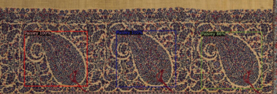

  # Design Motif Detection

  

This project aims at building model for detect/recognise design motifs under few-shot settings. This repo includes two approaches to do so
 

1. Finetuning Faster-RCNN. See []
2. Few-shot object detection based on [FewX](https://github.com/fanq15/FewX)

See individual folders  for instructions on implementation/training/evaluations.

# Installtion

Both faster-rcnn finetuning and few-shot approaches are built on top of [detectron2](https://github.com/facebookresearch/detectron2). Please follow the instruction in the offical page to[install detectron2] (https://detectron2.readthedocs.io/en/latest/tutorials/install.html).
You will also need to install appropriate pytorch and torchvision versions.
This repo is tested with `pytorch 1.10.1+cu111` and `detecton2 v0.6`
